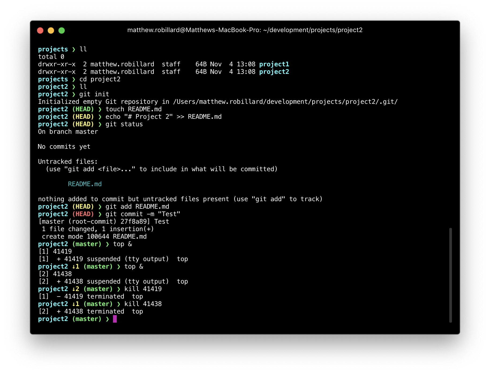

<p align="center">  <p align="center">Clean ZSH theme with Git support</p>

<p align="center"></p>

* Current working directory
* Hostname (Shown on remote SSH shell only)
* AWS Vault Role
* Background jobs
* Exit code of last command
* Git branch/status

## Installation 

If you are using Oh My ZSH, follow the instructions below:

```
wget -O $ZSH_CUSTOM/themes/common.zsh-theme https://raw.githubusercontent.com/mrobillard/matter-zsh-theme/master/matter.zsh-theme
```

Update your `.zshrc` file:

```
ZSH_THEME="matter"
```


